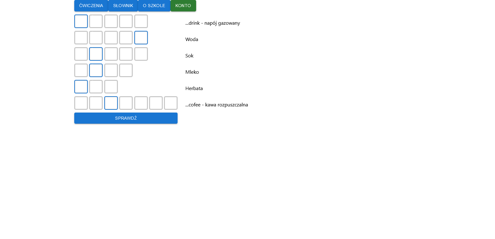

# PL
# Ćwiczenia językowe

**Technologie**  
React.js. Material UI  
Node.js + Express  
MongoDB, npm

Jednostronicowa aplikacja (SPA) z ćwiczeniami językowymi. 
Technicznie są to dwie aplikacje, gdyż oddzielnie uruchamia się front, a oddzielnie back end. 
**Front end**  
Składa się z zakładek: ćwiczenia, słownik, o szkole, konto. 
Dostępne ćwiczenia to:
1. Quiz — zestaw 10 pytań. Po zakończeniu zostaje wyświetlony wynik
2. Dopasowywanie — przeciąganie obrazków na angielskie nazwy przedmiotów
3. Krzyżówka — wpisywanie do kratek angielskich odpowiedników haseł  
Słownik to tabela z angielskim słowem po lewej a tłumaczeniem po prawej.

**Back end**  
Oparty na Node.js z frameworkiem Express. Łączy się z bazą MongoDB i obsługuje żądania. Z uwagi na charakterystykę Node.js, duża część żądań jest obsługiwana asynchronicznie.

**Uruchamianie**
1. Pobieramy z repozytorium foldery `front` i `server`.
2. Instalujemy Node.js (zawiera npm)
3. Instalujemy MongoDB (wystarczy sam serwer, bez Compassa)
4. Front  
4.1 Przechodzimy do folderu `front`  
4.2 Otwieramy wiersz poleceń  
4.3 Wpisujemy `npm install express` aby zainstalować Expressa   
4.4 Wpisujemy `npm install` aby zainstalować pozostałe biblioteki  
4.5 Wpisujemy `npm install react-scripts` aby zainstalować Reacta  
4.6 Następnie `npm start` aby uruchomić aplikację. Domyślnie uruchamia się na `localhost:3000`
5. Back  
5.1 Przechodzimy do folderu `server`  
5.2 Wpisujemy `npm start` aby uruchomić aplikację. Domyślnie uruchamia się na `localhost:3001`  
5.3 Back połączy się z bazą danych. Jeśli nie istnieje, to stworzy się automatycznie
6. Aplikacja jest gotowa do ćwiczeń

Styczeń 2022
# EN
**Technologies**  
React.js. Material UI  
Node.js + Express  
MongoDB, npm

Single Page Application (SPA) with language exercises. 
Technically this is two application, because frontend and backend is running separately. 
**Front end**  
Is composed with four tabs: exercise, dictionary, about school, account. 
Available exercises:
1. Quiz — set of 10 questions. On the end is displayed score
2. Matching — drag and drop images on English items names
3. Crossword — enter to grids English equivalent of definition  
   Dictionary is a table with English word on the left side and translate to Polish on right.

**Back end**  
Supported by Node.js with Express framework. Connected with MongoDB and process request. Characteristic feature of Node.js is, that all request is asynchronous.

**Launching**
1. Download from repo folders `front` and `server`.
2. Install Node.js (contains npm)
3. Install MongoDB (only server, without Compass)
4. Front  
   4.1 Go to `front` folder  
   4.2 Open command line  
   4.3 Enter `npm install express` to install Express  
   4.4 Enter `npm install` to install another libraries  
   4.5 Enter `npm install react-scripts` to install React  
   4.6 Enter `npm start` to run application. Default is running on `localhost:3000`
5. Back  
   5.1 Go to `server` folder  
   5.2 Enter `npm start` to run application. Default is running on `localhost:3001`  
   5.3 Back has been connected with database. If not exists, has been created automatically
6. Application is ready to work  

June 2022

Strona wyboru ćwiczeń  
Choose exercise page

Quiz  
Quiz

Dopasowywanie  
Matchings

Krzyżówka  
Crossword

Słownik  
Dictionary
